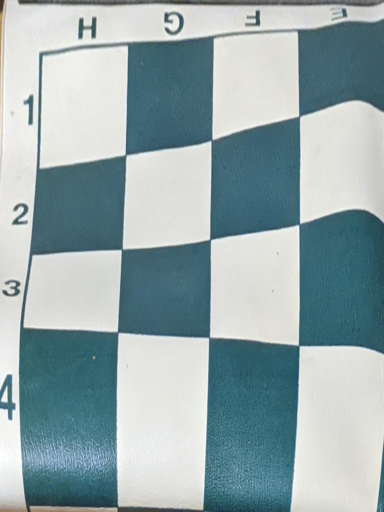

FEATURE MATCHING for AUTOSTITCHING:
===================================

#### I took some some pictures. For the first one I used a chess board as arefrnce because it's planar. For the second part I took three stationary pictures with different angles

  
  

Recover Homographies:
---------------------

#### First nedd to recover the homography transformation matrix. This way we are able to find how to move the pixles. By using p' = Hp and 4 control points in each image, we can solve for the matrix H.

#### We can simply want to buid the matrix below. Then we can solve it using least squared:

Warp the Images (Rectifying)
----------------------------

#### I applied to the homographic transformations on first three pictures, but since I didnt have second reference points I used the for corners or just estimated where they should form a rectangle

  

Blend the images into a mosaic
------------------------------

#### Blending was trickier than i thought. Although the result is not too bad but the edge where the images were connected together is visible. I think using a mask would produce better results.

  

What I learned?
---------------

#### After doing the project things that looked IMPOSIBLE are easy to do. I think there are alot of application that can be implemented using Homography. Taking linear algebra classes paid off :).

Detecting corner features in an image:
--------------------------------------

#### For this part we use the provided Harris code to get the points and their H value if we plot them we get:

 

#### now that we have our points we need to use ANMS and find best points we can use to make out patch, these points:

 

#### OK! so we have out points we need to find some features and for each point so we can find a good match in the other image. the featuers look like these.

 
 
 

#### we got the pathes and now we should go over each point withs its patch and compare agains every patch in the other image. afther that we should have some matches as these:

  

#### Now after we find the all matching points we need to pick the best ones that are close enough to compute the homography and warp the images. we are so close:

 
 

#### We are done now only thing left to do is use the final points and make a homography and warp all the images and baaaam:

 

#### the result:

